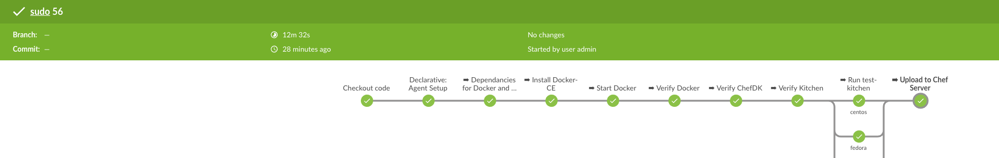
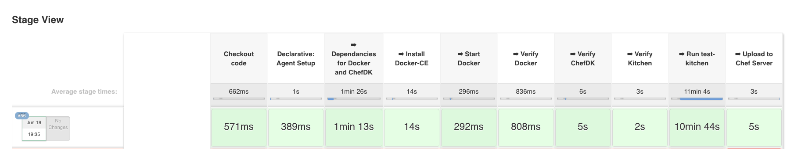
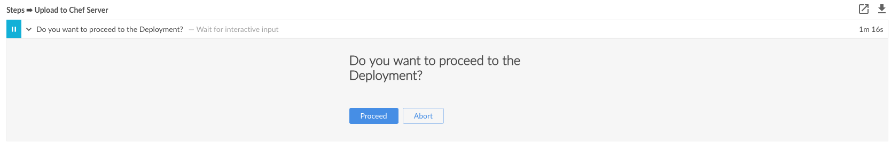

# Jenkinsfile example for cookbook development

With the revamping of Jenkins 2.0 and Blue Ocean, having a "drop in" cookbook
development Jenkins job seemed like a no brainer. This is a generic enough drop
in example with only a couple tweaks to make it work in your environment.

## Prerequisites

- Jenkins 2.2+
- Blue Ocean plugin with git set up
- Docker-CE on local box
- SSH access to the machine (for debugging)
- [Jenkinsfile](./Jenkinsfile) from this repo

## Explanation

This file was verified against the [sudo][sudo] cookbook from the chef-cookbooks
GitHub repository. It's supported by the Awesome Chef Community Engineering team,
and normally is verified via Travis. The Travis workflow works awesome in a public
setting, but this Jenkinsfile is a way to bring that same workflow in house. I chose
the Docker workflow to help create a quick disposable environment, so you have a "clean"
test bed every time you run your Pipeline.

This is only a framework, you will need to configure a few of the settings for your
specific use case, but this should be the lions share of the work you need. 
This Jenkinsfile is intended to be used as a "multi branch pipeline" job type in Jenkins, 
and live alongside your code. 

Here's an example of the Blue Ocean Pipeline:



And the "default" Pipeline plugin for Jenkins:



## Jenkinsfile

I'll walk through each section explain what each does, to make sure we are on the same
page. I consider a section `{..}`, and I'll name it via the line number too. Lets go!

- Line 1 `pipeline {` - This is the main declaration of the specific pipeline, everything goes in here.
- Line 2 `agent {` - This sets up the agent that does the work in the workspace. As you can see this command uses the standard `chef/chefdk` container with the [chefdk][chefdk] already in it. The `-u root` allows us to install some dependencies into the container, and because we use `kitchen-dokken` later on, we have "Docker in Docker" which is the bind mount of `/var/run/docker.sock`.
- Line 9 `triggers {` - This line is how often the pipeline should run. I put an `H` in for the min, which is a "random number". It also uses `pollSCM` to see if the git sha has changed, and only pulls down if it has. This helps with network overhead with larger repositories.
- Line 12 `stages {` - The location for all the "build stages" to be declared.
- Line 13 `stage('\u27A1 Dependencies for Docker and ChefDK') {` - The first place where real work is done. This stage updates the `apt` repositories, installs things required for Docker to be able to be built.
- Line 19 `stage('\u27A1 Install Docker-CE') {` - This installs standard Docker-CE, with it you can run `kitchen-dokken`.
- Line 27 `stage('\u27A1 Start Docker') {` - In my testing while installing Docker in Docker, the service _sometimes_ didn't start. This stage sends a start command to the service to make sure it is up and running.
- Line 32 `stage('\u27A1 Verify Docker') {` - Verifying Docker is a safe sanity check in this pipeline. Running the `docker run hello-world` shows you can call out to the Public Repos, run the docker command, and have an output.
- Line 37 `stage('\u27A1 Verify ChefDK') {` - This verifies that the ChefDK commands run as expected. Also it helps with debugging version numbers if something goes off the rails.
- Line 44 `stage('\u27A1 Verify Kitchen') {` - Because we are focusing on using `kitchen-dokken` as our driver, this outputs all the versions of the suites and platforms. It also verifies that `test-kitchen` is properly set up and can take commands.
- Line 48 `stage('\u27A1 Run test-kitchen') {` - The true meat of this file. We run `kitchen-dokken` for each of the five platforms in _parallel_ (Line 55). This allows for concurrency and faster verification. Also using `test` as the command, it cleans up the previous containers, and run the Inspec validation after each of the converges allowing for better visibility.
- Line 74 `stage('\u27A1 Upload to Chef Server') {` - And as a final stage, we can upload the cookbook to our Chef server. Now, if you've read this far, you'll probably be wondering how to do this, we haven't done any configuration to this. That's our next section.

## Publishing or "shipping code"

Now that you've configured your Jenkinsfile with the generic `chef/chefdk` you'll
probably want to publish to your Chef server if everything has passed. This next
section is a tad bit more complex, but pretty straight forward.

Go ahead and spin up the `chef/chefdk` Docker container:

```bash
$ docker run -it chef/chefdk /bin/bash
root@7425261cb693:/#
```

In another window/terminal run the following command to figure out the docker container id:

```bash
$ docker ps
CONTAINER ID        IMAGE               COMMAND             CREATED             STATUS              PORTS               NAMES
7425261cb693        chef/chefdk         "/bin/bash"         54 seconds ago      Up 53 seconds                           laughing_lovelace
$
```

Back on the `chef/chefdk` docker container, create a `.chef` directory at `$HOME` which is `/`:

```bash
root@7425261cb693:/# mkdir .chef
```

Then copy in your `knife.rb`, `key.pem`, `validator.pem` from your workstation to that directory:

```bash
$ docker cp ~/.chef/knife.rb 7425261cb693:/.chef/
$ docker cp ~/.chef/my-key.pem 7425261cb693:/.chef/
$ docker cp ~/.chef/my-validator.pem 7425261cb693:/.chef/
```

You should be able to run `knife status` from your docker container now, it should be able to talk to your
chef server.

```bash
root@7425261cb693:/# chef exec knife status
20 minutes ago, web01
```

Awesome! OK, so now we need to commit and save this container. Occasionally, you'll need to go through these
steps when a new `chef/chefdk` base container is released, back to the `versioning` step.

Back on the workstation, we are going to set up a local registry, inject the container into it.

```bash
$ docker run -d -p 5000:5000 --restart=always --name registry registry:2 # start up registry container if not already started
$ docker commit -m "keys included for Chef Server" 7425261cb693 # commit the changes to the container
$ docker images -a # list images to verify that it has been committed
$ docker tag 7425261cb693 localhost:5000/chefdkkeysv1 # tag the image you committed
$ docker push localhost:5000/chefdkkeysv1 # push to local registry
```

You should be able to take the container and ship it to where you run Docker from your Jenkins box. There are
a ton of variants here so I'll go ahead an let you figure that one out. **NOTE**: Being your keys are in this container
now, realize that it should NOT GO TO THE PUBLIC REGISTRY.

Now that you have it in a location that your Jenkins instance can reach it, all you need to do is change the following setting
and you should be able to pull the container down now:

```
docker {
  reuseNode false
  args '-u root -v /var/run/docker.sock:/var/run/docker.sock'
  image 'chefdkkeysv1'
}
```

With this, your final stage of `stage('\u27A1 Upload to Chef Server') {` should start publishing to your
chef server if everything passes. Note this only happens on the production branch (see the `when` statement).

## Input or Approval Gate

If you would like to add a gate to `Approval` or `Disapproval` it's a simple line to add!

```
stage('\u27A1 Upload to Chef Server') {
  steps {
    input 'Do you want to proceed to the Deployment?'
    sh 'chef exec knife cookbook upload sudo -o ../'
  }
}
```

Here's an image of what it looks like on Blue Ocean!



## Conditionally running stages only on specified branches

On line 51: 

```
when {
    anyOf { branch 'master'; branch 'staging' }
}
```
specifies that the 'Run test-kitchen' stage should run only on the master, staging or production branches. No need to do this work on other experimental branches. 
Likewise, on the upload stage, it will be skipped unless the production branch is updated. You can specify a single branch or multiple branches to run on.


## Conclusion

Hopefully this will give you the framework you need to get your own Jenkinsfile configured for your own environment.
There are a few configurations you'll need to make in the process, namely the `keys` and `knife.rb` but assuming you
just want to verify you can drop the final example `stage`. If you have questions never hesitate to reach out via
the Chef-Community Slack, `@jj`.

## License

Author:: JJ Asghar ([jj@chef.io](mailto:jj@chef.io))

Copyright:: Copyright (c) 2017 JJ Asghar

License:: Apache License, Version 2.0

```text
Licensed under the Apache License, Version 2.0 (the "License");
you may not use this file except in compliance with the License.
You may obtain a copy of the License at

    http://www.apache.org/licenses/LICENSE-2.0

Unless required by applicable law or agreed to in writing, software
distributed under the License is distributed on an "AS IS" BASIS,
WITHOUT WARRANTIES OR CONDITIONS OF ANY KIND, either express or implied.
See the License for the specific language governing permissions and
limitations under the License.
```

[chefdk]: http://chefdk.io
[sudo]: https://github.com/chef-cookbooks/sudo
